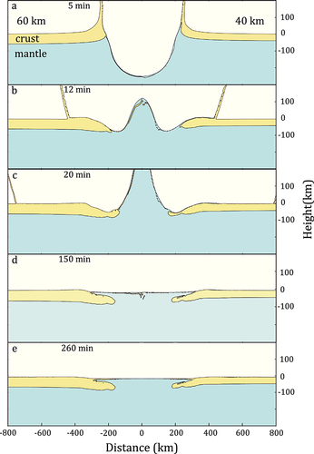

**Shaohui Liu**

**[Home](../index.html)    [Posts](../posts.html)    [Timeline](../timeline.html)    [Research](../research.html)**

---

### 撞击之后的壳幔结构

**尚未有系统性测试。但是目前调研的文献表明：撞击区域会出现地壳变薄、地幔上涌的“凸”形地幔结构。**

调研的文献详情如下：

### 0 Zhu, Numerical modeling of the ejecta distribution and formation of the Orientale basin on the Moon

撞击过程中月壳和月幔物质的分布（左侧为60km厚、右侧为40km厚的月壳）

撞击完成后月壳厚度图（左侧为60km厚、右侧为40km厚的月壳）；其中实线是观测，虚线是数值模型的月壳厚度结果（如上图所示）

### 1 Wieczork, Lunar Multiring Basins and the Cratering Process

该文献利用重力数据反演了月球上各个撞击坑下方的结构，其结果如下：

根据重力数据反演的月球上各个撞击坑的下方结构（白色是斜长石月壳、黑色是玄武岩填充

### 2 Lompa, Numerical Investigation of Lunar Basin Formation Constrained by Gravity Signature

数值模型中撞击之后的重力及密度分布

撞击附近重力剖面的地下结构（壳、幔）分布示意图

